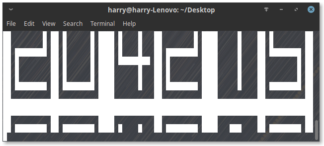

# TClock

A large digital clock that runs in a terminal.  
This clock has two main animation methords:
<ul>
  <li>Flash - Clears the screen.</li>
  <li>Scroll - The new times scrolls up from beneath.</li>
</ul>

## ToDo
- [x] Displays time
- [x] CLI menu
- [x] Argument management
- [x] Help
- [ ] One Instance
- [ ] Write out to file
- [ ] Count down
- [ ] Graphical Mode

## Help

<pre>Usage: tclock [OPTION] [FILE, DATE]...

no optin		Default settings
-m			CLI Menu
-g			GitHub Link

<b>In Development</b>
<b>-i</b>			<b>One Instance (good for &apos;watch&apos; command or just to check time) [InDevelopment]</b>
<b>-w [FILE]</b>		<b>Write out to file [InDevelopment]</b>
<b>-c [DATE]</b>		<b>Count Down to that date [InDevelopment]</b>
<b>-g</b>			<b>Graphical Mode [InDevelopment]</b>
</pre>

## Requirements
### Minimum

<ul>
  <li>Width - 81 characters</li>
  <li>Heights - 14 characters</li>
  <li>python3.x installed</li>
  <li>3709 bytes free</li>
  <li>17.9 MiB of RAM free</li>
</ul>

### Recomended

<ul>
  <li>Width - 81 characters</li>
  <li>Heights - 14 characters</li>
  <li>Python3.6.7 installed</li>
  <li>1 MiB free</li>
  <li>1 GiB of RAM free</li>
  <li>GNU/Linux</li>
</ul>
  
## Screenshots
### Scroll animation in effect

## How to get the most out of this clock (GNU/Linux)

<ol>
  <li>Press ctr+alt+F2 to enter a termianl view and login again.</li>
  <li>Go to the directory it is stored in using the cd comand</li>
  <li>run it with python3</li>
  <li>Watch it for a couple seconds to a couple years.</li>
</ol>

## How to get the most out of this clock (windows)

<ol>
  <li>Install python3.x from <a href="https://www.python.org/downloads/release/python-372/">python.org</a>.</li>
  <li>Double click the python file and then when cmd opens it press F11 to go fullscreen</li>
</ol>
