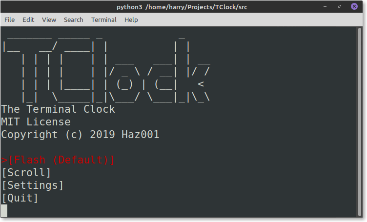
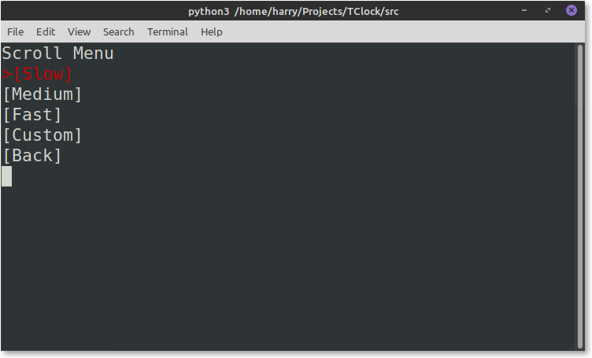

# TClock
```
 _______ _____ _            _
|__   __/ ____| |          | |
   | | | |    | | ___   ___| | __
   | | | |    | |/ _ \ / __| |/ /
   | | | |____| | (_) | (__|   <
   |_|  \_____|_|\___/ \___|_|\_\
The Terminal Clock
MIT License
Copyright (c) 2019 Haz001
```
Version 1.1

A large digital clock that runs in a terminal. <br/>
This clock has two main animation methords:

- Flash - Clears the screen.</li>
- Scroll - The new times scrolls up from beneath.</li>


## ToDo
- [x] Displays time
- [x] CLI menu
- [x] Single argument management
- [x] Help
- [x] Saving Settings
- [x] Multi argument management
- [ ] Revamp CLI and Draw processes
- [ ] Add Curses Draw to the mix
- [ ] Man file
- [ ] One Instance option
- [ ] Windows version, currently using curses module that doesn't exist in Windows, will add windows friendly menu
- [ ] Write out to file, so you don't have to use ```tclock -i >> filename```
- [ ] Multiple types of frames
- [ ] Mutliple font sizes, small, medium and large
- [ ] Count down, takes a date and counts down to it
- [ ] Graphical Mode

<progress value="5" max="14">35.7%</progress>

## Help

<pre>Usage: tclock [OPTION] [FILE, DATE]...

no optin		Default settings
-m			CLI Menu
-git			GitHub Link

<span style="background-color:#CC0000"><b>In Development</b></span>
<span style="background-color:#CC0000"><b>-i</b></span>			<span style="background-color:#CC0000"><b>One Instance (good for &apos;watch&apos; command or just to check time) [InDevelopment]</b></span>
<span style="background-color:#CC0000"><b>-w [FILE]</b></span>		<span style="background-color:#CC0000"><b>Write out to file [InDevelopment]</b></span>
<span style="background-color:#CC0000"><b>-c [DATE]</b></span>		<span style="background-color:#CC0000"><b>Count Down to that date [InDevelopment]</b></span>
<span style="background-color:#CC0000"><b>-g</b></span>			<span style="background-color:#CC0000"><b>Graphical Mode [InDevelopment]</b></span>
</pre>

## Requirements
### Minimum

- Width - 56 characters
- Heights - 15 characters
- python3.6 installed
- 97 KiB free
- 64 MiB of RAM free


### Recomended (been tested on)

- Width - 56 characters
- Heights - 15 characters
- Python3.7.5 installed
- 1 MiB free
- 1 GiB of RAM free
- GNU/Linux


## Screenshots
### Menu

### Flash

### Scroll options

### Scroll animation in effect

### Invert

## How to get the most out of this clock (GNU/Linux)
### 
### LightDM
<ol>
  <li>Press ctr+alt+F3 to enter a termianl view and login again</li>
    <ul>
        To return to your normal GUI life just press:
        <li>`CTR+ALT+F2` for GDM3 people</li>
        <li>`CTR+ALT+F7` for LightDM people</li>
        If you don't know what display manager you use just try both of them.
    </ul>
  <li>Run tClock</li>
  <li>Watch it for a couple seconds to a couple years.</li>
</ol>

<!--
## How to get the most out of this clock (windows)

<ol>
  <li>Install python3.x from <a href="https://www.python.org/downloads/release/python-372/">python.org</a>.</li>
  <li>Double click the python file and then when cmd opens it press F11 to go fullscreen</li>
</ol>
-->
