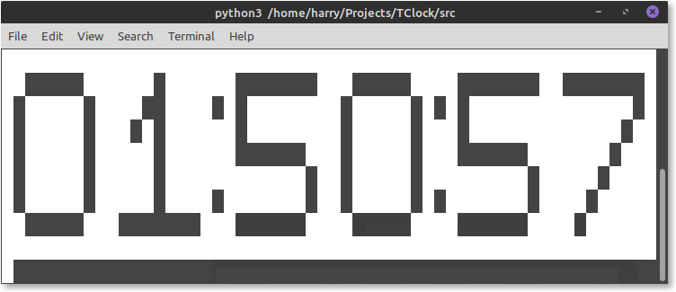

TClock
-----
```
 _______ _____ _            _
|__   __/ ____| |          | |
   | | | |    | | ___   ___| | __
   | | | |    | |/ _ \ / __| |/ /
   | | | |____| | (_) | (__|   <
   |_|  \_____|_|\___/ \___|_|\_\
The Terminal Clock
MIT License
Copyright (c) 2019 Haz001
```
Version 1.3

A large digital clock that runs in a terminal. <br/>
This clock has two main animation methords:

- Flash - Clears the screen.</li>
- Scroll - The new times scrolls up from beneath.</li>


## ToDo
- [x] Displays time
- [x] CLI menu
- [x] Single argument management
- [x] Help
- [x] Saving Settings
- [x] Multi argument management
- [ ] Revamp CLI and Draw processes
  - Make it Windows compatible
  - Make it more advanced to allow more effects and stuff.
- [ ] Add Curses Draw as an option to see the time
  - this will allow different aligned text and cooler effects like dissolve and wipe effects
- [ ] Man file
  - for Unix and Unix-Like (Linux) users to be able to get a manual.
- [ ] uptime mode to display uptime
- [x] One Instance option ```tclock -i```
  - Quickly get the time

- [ ] Write out to file, so you don't have to use ```tclock -i >> filename```
- [ ] Multiple types of frames
- [ ] Mutliple font sizes, small, medium and large
- [ ] Count down, takes a date and counts down to it
- [ ] Graphical Mode

<progress value="5" max="14">35.7%</progress>

## Help

```
_______ _____ _            _
|__   __/ ____| |          | |
  | | | |    | | ___   ___| | __
  | | | |    | |/ _ \ / __| |/ /
  | | | |____| | (_) | (__|   <
  |_|  \_____|_|\___/ \___|_|\_\
The Terminal Clock
MIT License
Copyright (c) 2019 Haz001

Usage: tclock [OPTION] [FILE, DATE]...

no option           Default settings
-h, --help          Help Menu
-m, --menu          CLI Menu
-G, --git           GitHub Link
-i, --inst          One Instance (draws, through print and closes)
In Development
-w [FILE]           Write out to file [InDevelopment]
-c [DATE]           Count Down to that date [InDevelopment]
-g                  Graphical Mode [InDevelopment]

```

## Requirements
### Minimum

- Width - 56 characters
- Heights - 15 characters
- python3.6 installed
- 97 KiB free
- 64 MiB of RAM free


### Recomended (been tested on)

- Width - 56 characters
- Heights - 15 characters
- Python3.7.5 installed
- 1 MiB free
- 1 GiB of RAM free
- GNU/Linux


## Screenshots
### Menu


### Flash



### Scroll options


### Scroll animation in effect


### Invert


## How to get the most out of this clock:
### Unix and Unix like Systems
1. Press `CTRL + ALT + F3` to enter into terminal mode and login
  - To return to your normal GUI life just press:
    - `CTRL + ALT + F2` for GDM3
    - `CTRL + ALT + F7` for LightDM<br/>
    If you don't know what display manager you are just press `F1` to `F7` with `CTRL + ALT` held down.
2. Go into the Menu and customize your clock
  - If you installed it use the command `tclock -m`
  - If you cloned the git repo `cd` into `src` directory and then type `python3 tclock.py -m`
3. Use the CLI menu to customize your clock
4. Go to the main menu and enter into either Flash or Scroll to see your customized clock display the time.
5. Watch the time pass by second by second for either a few seconds or a few days or years
<!--
## How to get the most out of this clock (windows)

<ol>
  <li>Install python3.x from <a href="https://www.python.org/downloads/release/python-372/">python.org</a>.</li>
  <li>Double click the python file and then when cmd opens it press F11 to go fullscreen</li>
</ol>
-->
